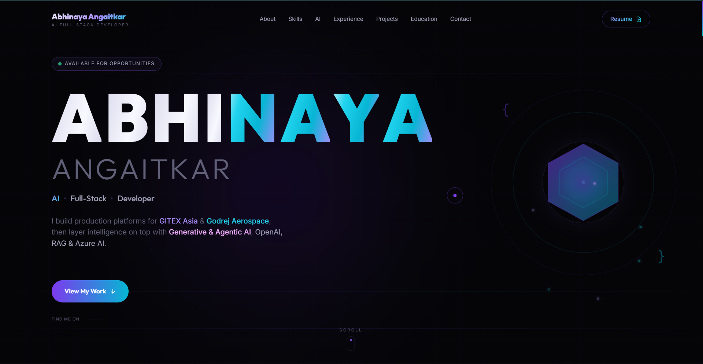

# Abhinaya Angaitkar · AI Full-Stack Developer Portfolio

A modern, animated personal portfolio for **Abhinaya H. Angaitkar**, an AI Full-Stack Developer.
It showcases full-stack engineering work alongside an "Intelligence Layer" of Generative AI,
Agentic AI, AI Agents and Retrieval-Augmented Generation (RAG) capabilities.

Built with **Next.js 14 (App Router)**, **TypeScript**, **Tailwind CSS**, **GSAP** and **Framer Motion**.



---

## Features

- **AI-first positioning** with a dedicated "Intelligence Layer" section (Generative AI, Agentic AI, RAG, AI Full-Stack Integration).
- **Multilingual animated loader** (Marathi, Hindi, English, Japanese greetings).
- **Cinematic GSAP + Framer Motion animations** with scroll-triggered reveals.
- **Fully responsive** and mobile-safe (uses small-viewport height so the hero fits every screen).
- **SEO ready** with rich metadata, Open Graph tags and keywords.
- **Single source of content** in `src/lib/data.ts`, so updates are quick and safe.
- **Custom cursor**, ambient glows, grid overlays and gradient typography.

---

## Tech Stack

| Layer         | Technologies                                             |
| ------------- | -------------------------------------------------------- |
| Framework     | Next.js 16 (App Router)                                  |
| Language      | TypeScript                                               |
| Styling       | Tailwind CSS                                             |
| Animation     | GSAP (ScrollTrigger), Framer Motion, Lenis smooth scroll |
| Icons         | react-icons (Simple Icons, Tabler, Feather, Font Awesome) |
| Fonts         | Outfit, Inter, Cormorant Garamond (via `next/font`)     |

---

## Project Structure

```
abhinaya-portfolio/
├── public/
│   ├── ui-screenshot.png              # UI preview used in this README
│   └── Abhinaya_Angaitkar_Resume.pdf  # Downloadable resume
├── src/
│   ├── app/
│   │   ├── layout.tsx                 # Root layout, fonts & SEO metadata
│   │   ├── page.tsx                   # Home page (section composition)
│   │   └── globals.css                # Global styles & design tokens
│   ├── components/
│   │   ├── Loader.tsx                 # Multilingual intro loader
│   │   ├── Header.tsx                 # Navigation bar
│   │   ├── Hero.tsx                   # Landing hero
│   │   ├── About.tsx                  # About + stats
│   │   ├── Skills.tsx                 # Tech stack grid (AI category first)
│   │   ├── AICapabilities.tsx         # "Intelligence Layer" AI section
│   │   ├── Experience.tsx             # Work experience
│   │   ├── Projects.tsx               # Featured projects
│   │   ├── Education.tsx              # Education timeline
│   │   ├── Quote.tsx                  # Personal quote
│   │   ├── Contact.tsx                # Contact section
│   │   ├── Footer.tsx                 # Footer
│   │   └── CustomCursor.tsx           # Custom cursor (client only)
│   └── lib/
│       └── data.ts                    # All portfolio content (single source of truth)
├── next.config.mjs
├── tailwind.config.ts
├── tsconfig.json
└── package.json
```

---

## Getting Started

### Prerequisites

- **Node.js 18.17 or later** (Next.js 14 requirement)
- **npm** (bundled with Node.js)

### Installation

Clone the repository, move into the project folder and install dependencies:

```bash
git clone https://github.com/Abhinaya3107/abhinaya-portfolio.git
cd abhinaya-portfolio
npm install
```

### Run in Development

Start the development server with hot reload:

```bash
npm run dev
```

Open [http://localhost:3000](http://localhost:3000) in your browser to view the portfolio.
The page auto-updates as you edit files.

---

## Production Build

Create an optimized production build and then start the production server:

```bash
npm run build
npm run start
```

`npm run build` compiles and optimizes the app; `npm run start` serves the built output
(by default at [http://localhost:3000](http://localhost:3000)).

---

## Available Scripts

| Command         | Description                                    |
| --------------- | ---------------------------------------------- |
| `npm run dev`   | Start the development server (hot reload)      |
| `npm run build` | Create an optimized production build           |
| `npm run start` | Serve the production build                      |
| `npm run lint`  | Run ESLint checks                              |

---

## Customization

All content lives in a single file, **`src/lib/data.ts`**. Update it to personalize the site:

- `personalInfo` – name, role, tagline, summary, contact links and resume URL.
- `skills` and `skillPills` – categorized skills and the scrolling skill tags.
- `aiCapabilities` – cards shown in the "Intelligence Layer" AI section.
- `experience` – work history entries.
- `projects` – featured projects.
- `education` – education timeline.

To replace the resume, drop your PDF into `public/` and point `personalInfo.resumeUrl` to it.
To update the preview image in this README, replace `public/ui-screenshot.png`.

---

## Deployment

This app deploys with zero configuration on **[Vercel](https://vercel.com/new)** (the creators of Next.js):

1. Push the repository to GitHub.
2. Import the project into Vercel.
3. Vercel auto-detects Next.js and deploys on every push.

It can also be deployed to any platform that supports a Node.js server (run `npm run build`
followed by `npm run start`).

---

## Author

**Abhinaya H. Angaitkar** · AI Full-Stack Developer, Pune, India

- LinkedIn: [abhinaya-angaitkar](https://linkedin.com/in/abhinaya-angaitkar-43720021a)
- GitHub: [@Abhinaya3107](https://github.com/Abhinaya3107)
- Email: abhinayaangaitkar0731@gmail.com

---

## License

This project is provided for personal portfolio use. Feel free to reference it for learning,
but please replace the personal content before reusing it as your own.
